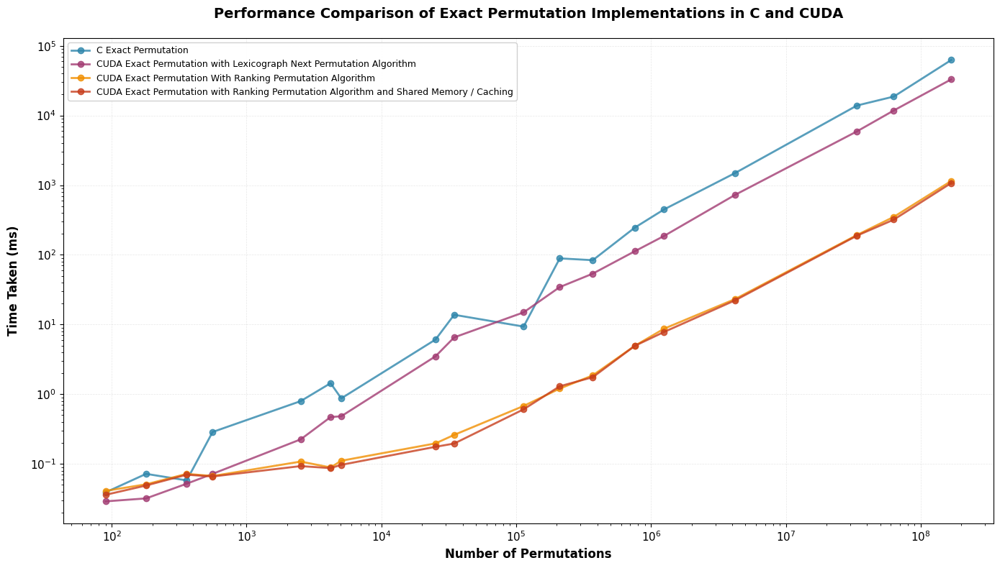
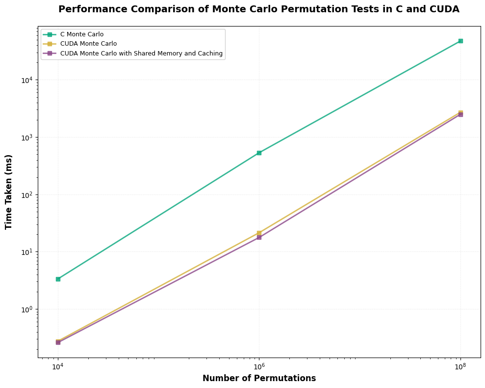
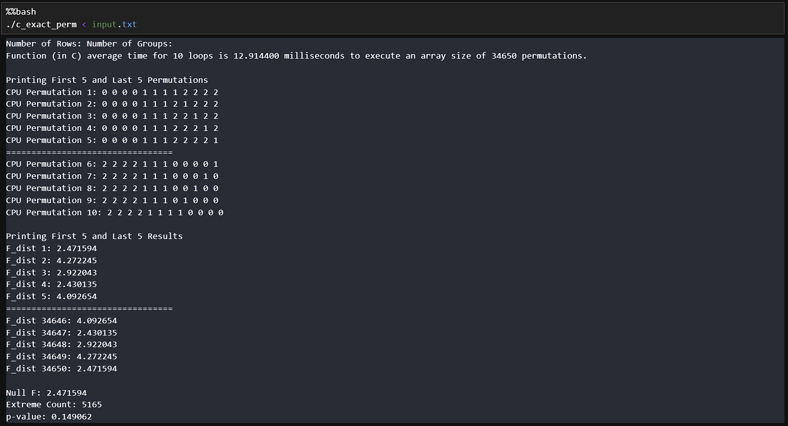
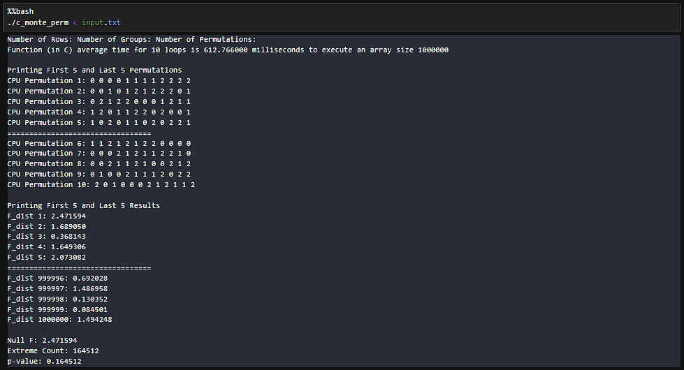
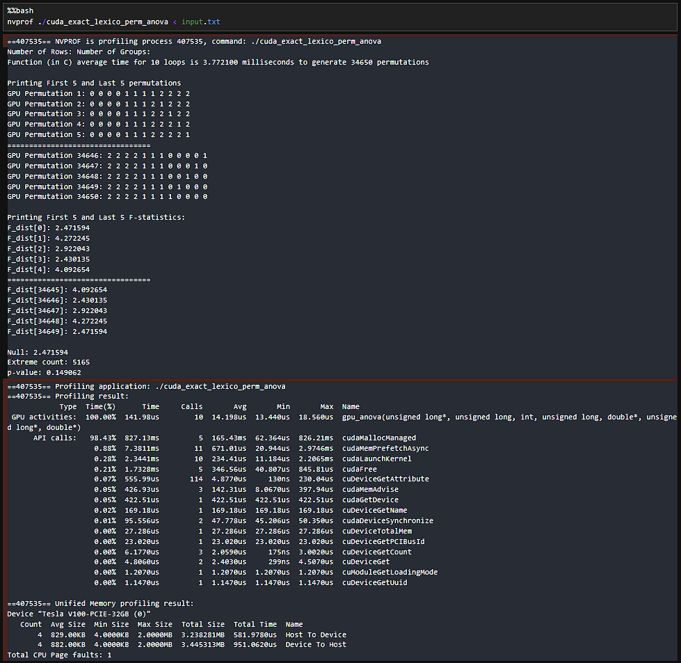
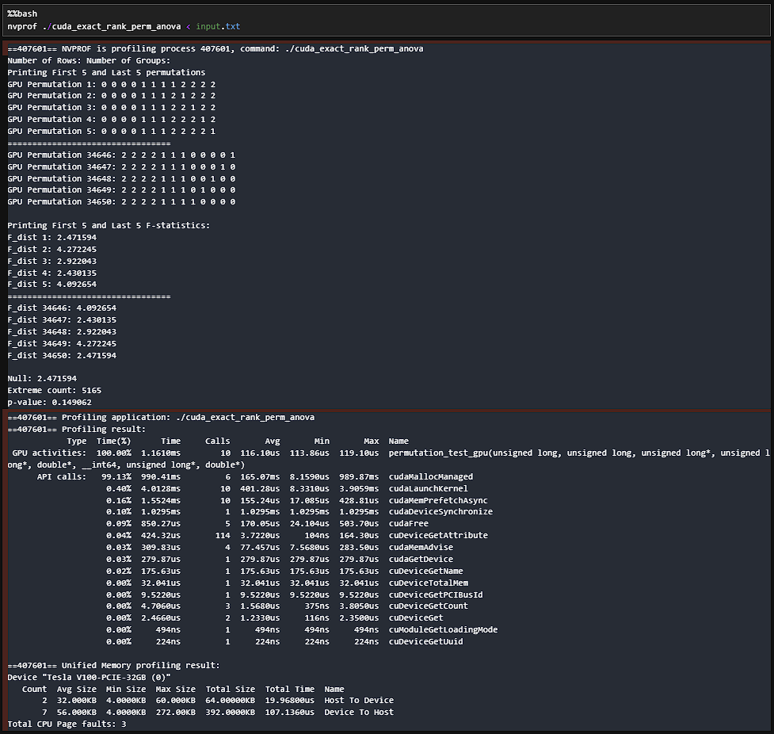
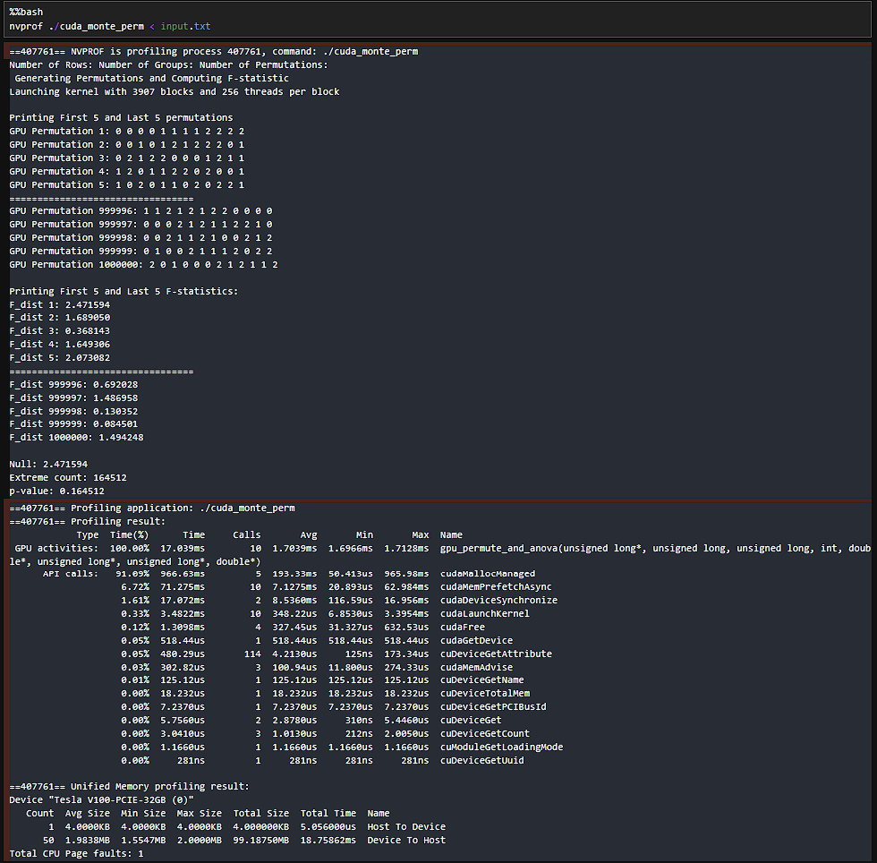
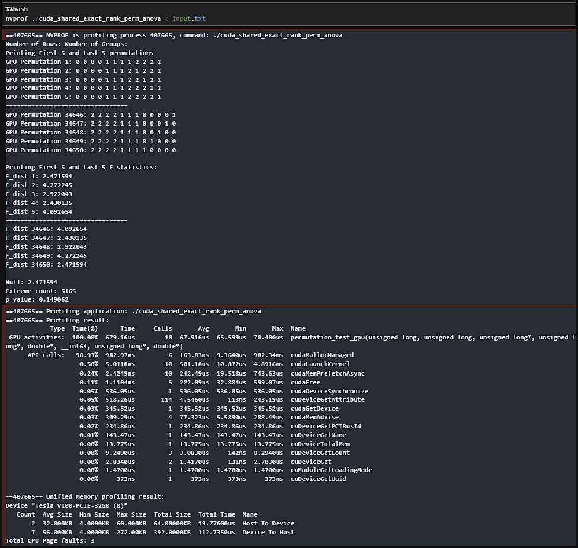
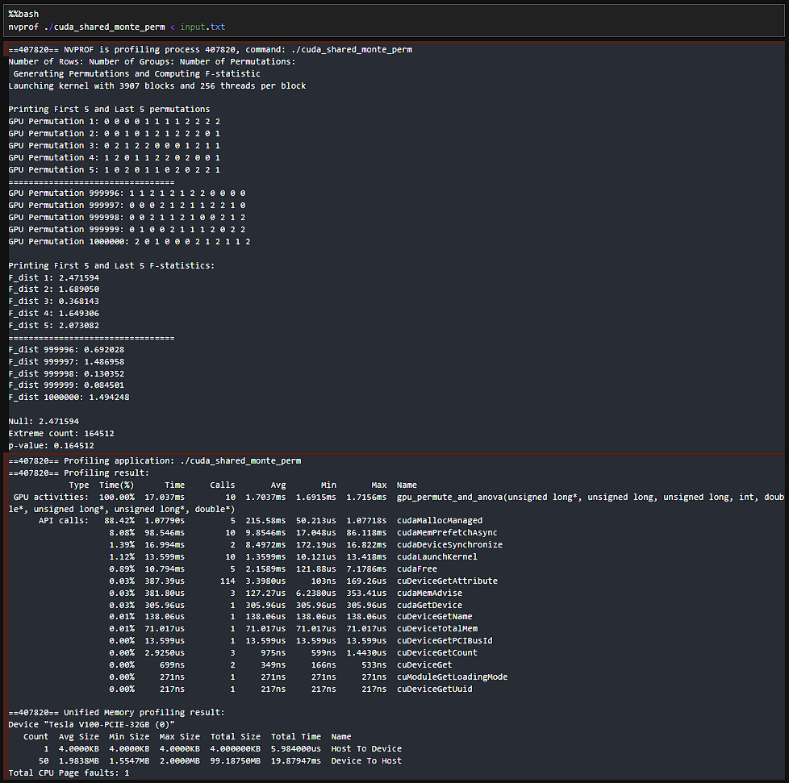

# GPU-Accelerated Permutation Test for One-Way ANOVA  
## **Integrating Project — C vs CUDA Performance Evaluation**

### Members:
- Go, Daphne
- Lasala, Kyle
- Manlises, Monica

---

# 1. Overview

This project implements both ***exact*** and ***Monte Carlo permutation tests*** for the ***one-way ANOVA*** statistic, comparing:

- ***Serial C implementation***
- ***CUDA-accelerated GPU implementation (SIMT model)***

Permutation tests are widely used in fields such as neuroimaging, genomics, and experimental sciences, but become computationally expensive due to the factorial growth of possible permutations. This project benchmarks performance, evaluates memory limitations, and quantifies the accuracy of Monte Carlo approximations against exact permutation results.

### **Inputs to Project**
- Data matrix: $X = \{ x_{ij} \}$
- Group labels: $G=g_1, g_2, \ldots, g_N$
- Number of unique groups: $k$
- Number of permutations: $P$

### **Outputs**
- Exact null distribution of $F$-statistic 
- $p$-value for the permutation test.
- Performance metrics: runtimes (serial vs CUDA), speedup factors, GPU utilization.
- Output accuracy: outputs are compared to the ground truth, and errors will be shown.

---

# 2. Sequential Algorithm (C Implementation)

The sequential permutation test computes the ANOVA statistic for each permutation one at a time.

### **Step 1 — Generate a permutation of labels**
3 ways:
- Lexicographic Next Permutation (for Exact Permutation Test)
    - This algorithm generates a permutation dependent from the previous permutation
- LCG + Fisher–Yates shuffle (for Monte Carlo Method)

### **Step 2 — Compute group means**
$$
\mu_i = \frac{1}{n_i} \sum_{j=1}^{n_i} x_{ij}
$$

### **Step 3 — Compute within-group sum of squares**
$$
SSE = \sum_{i=1}^k \sum_{j=1}^{n_i} (x_{ij} - \mu_i)^2
$$

### **Step 4 — Compute between-group sum of squares**
$$
SSR = \sum_{i=1}^k n_i (\mu_i - \mu)^2
$$

### **Step 5 — Compute ANOVA statistic**
$$
F = \frac{SSR/(k-1)}{SSE/(N-k)}
$$

### **Step 6 — Repeat Steps 2–5 for all $P$ permutations**

### **Step 7 — Compute final $p$-value**

---

# 3. Sequential → Parallel Conversion

### 3.1. What was parallelized?
1. Creation of the permutations (Sequential Step 1)
    - ***Rank-based permutation*** (for Exact Permutation Test)
      - Lexicographic Next was implemented in CUDA as well but proved to be a bottleneck since the creation of a permutation is dependent on a previous permutation. In this case, Lexicographic Next was executed by the CPU. The results of these were still noted below
      - In contrast to Lexicographic Next, Rank-based is a parallelization method that allows the permutations to be independently created without relying on the previous permutation. This essentially makes one permutation a GPU thread which will be able to complete the next steps independently.  Rank-based permutation in itself has a higher time complexity than Lexicographic Next, but due to parallelization and the use of threads, it makes the overall program faster.
2. Looping across all Permutations (Sequential Step 6, which repeats Steps 2-5)
    - Instead of getting the $F$-statistic of each permutation inside a large for-loop, CUDA executes many of them in parallel utilizing the Single Instruction, Multiple Threads (SIMT) model. With this, each permutation is a thread that computes its own $F$-statistic.

### Key idea:
> ***Each permutation becomes an independent GPU thread.***

| Sequential Step | Parallel CUDA Version |
|-----------------|------------------------|
| Generate all $P$ permutations | ***Mapped to GPU threads*** (1 thread = 1 permutation) |
| Loop over all $P$ permutations one-by one| Handle multiple permutations at a time |
| Compute $\mu_i$ | Compute $\mu_i$ for multiple permutations at a time |
| Compute $SSE$ | Compute $SSE$ for multiple permutations at a time |
| Compute $SSR$ | Compute $SSR$ for multiple permutations at a time |
| Compute $F$ | Compute $F$ for multiple permutations at a time |

These are the ***core computational bottlenecks*** in the sequential algorithm that are ideal for parallelism because computataions for each permutation are independent.

---

## 3.2. CUDA Kernel Structure (Per Thread)

Each thread performs:

1. Identification of permutation index/rank  
2. Getting of its own section of the `perm_array`
3. Building (Permutation) of group assignments
4. Computation of:
   - $\mu_i$ for all groups  
   - $SSE$  
   - $SSR$  
   - $F$
5. Writing of result to global memory

### CUDA Optimizations:
- Grid-stride loops
- `cudaMemAdvise`  
- `cudaMemPrefetchAsync`
- Shared memory caching
    - For exact permutation test, $X$, $n_i$, and the indices of each group were cached. This will be used by the threads for Rank-based multiset permutation and $F$-statistic computation.
    - For Monte Carlo, $X$ and $G$ were cached. This will be used by LCG + Fisher–Yates shuffle and $F$-statistic computation.

---

## 3.3. Why These Steps Were Parallelized

The total cost when doing this sequentially is:

$$
\text{Cost} = O(P\times N)
$$
where 
$$
P=\frac{N!}{\prod (k_i!)}
$$

Because each permutation is ***independent***:

- It is ideal for data-parallel execution  
- GPU can handle multiple permutations simultaneously  
- Sequential algorithm becomes infeasible for large $P$  

Using CUDA reduces effective time to roughly:

$$
O\left(\frac{P}{\text{threads}}\right)
$$

which yields ***significant acceleration***.

---

## 3.4. Components That Remain Sequential

| Component | Reason |
|----------|--------|
| $p$-value computation | Final reduction step, minimal cost |
| Input preprocessing | Lightweight, no benefit from parallelism |

These steps do not benefit meaningfully from GPU parallelization.

---
# 4. Results

## 4.1. Exact Permutation Runtime Results (Runs = 10)
*Note:*
- *For all CUDA Implementations, CUDA Execution time = Average GPU Kernel Time + HtoD + DtoH*
- *For CUDA Exact Permutation with Lexicographic Next Permutation Algorithm, we get the execution time (serial) of generating the permutations and add this with the CUDA Execution time of computing for $F$-statistic.*
### $k$ = 3

| $N$ | Permutations | C (ms) | CUDA Lexico (ms) | CUDA Rank (ms) | CUDA Rank + Shared (ms) |
|---|--------------|--------|------------------|----------------|--------------------------|
| 6 | 90 | 0.039 | 0.029 | 0.041 | 0.036 |
| 8 | 560 | 0.287 | 0.072 | 0.067 | 0.066 |
| 10 | 4,200 | 1.440 | 0.470 | 0.089 | 0.087 |
| 12 | 34,650 | 13.804 | 6.541 | 0.261 | 0.196 |
| 14 | 210,210 | 89.014 | 34.474 | 1.205 | 1.301 |
| 15 | 756,756 | 245.883 | 112.572 | 4.243 | 4.943 |
*Note: For $N=14,15$, no shared memory/caching was faster*

---

### $k = 4$

| N | Permutations | C (ms) | CUDA Lexico (ms) | CUDA Rank (ms) | CUDA Rank + Shared (ms) |
|---|-------------|--------|------------------|----------------|--------------------------|
| 6 | 180 | 0.072 | 0.032 | 0.051 | 0.049 |
| 8 | 2,520 | 0.780 | 0.225 | 0.108 | 0.095 |
| 10 | 25,200 | 6.090 | 3.501 | 0.197 | 0.176 |
| 12 | 369,600 | 83.872 | 53.786 | 1.866 | 1.756 |
| 14 | 4,204,200 | 1,495.727 | 727.265 | 23.241 | 22.279 |
| 15 | 63,063,000 | 18,693.347 | 11,805.892 | 350.908 | 320.082 |

---

### $k = 5$

| N | Permutations | C (ms) | CUDA Lexico (ms) | CUDA Rank (ms) | CUDA Rank + Shared (ms) |
|---|-------------|--------|------------------|----------------|--------------------------|
| 6 | 360 | 0.058 | 0.052 | 0.072 | 0.070 |
| 8 | 5,040 | 0.872 | 0.485 | 0.111 | 0.097 |
| 10 | 113,400 | 22.347 | 14.246 | 0.678 | 0.602 |
| 12 | 1,247,400 | 448.511 | 186.704 | 8.713 | 7.820 |
| 14 | 33,633,600 | 13,903.838 | 5,919.028 | 192.685 | 188.625 |
| 15 | 168,168,000 | 62,526.456 | 33,012.392 | 1,148.178 | 1,073.867 |

---

## 4.2. Monte Carlo Runtime Results (N = 10, k = 4)

| # Permutations | C (ms) | CUDA (ms) | CUDA + Shared (ms) |
|----------------|--------|-----------|---------------------|
| 10⁴ | 3.349 | 0.275 | 0.260 |
| 10⁶ | 534.394 | 21.473 | 17.736 |
| 10⁸ | 47,538.018 | 2,713.450 | 2,502.474 |

---
## 4.3. Comparison of Runtimes
Exact Permutation Runtimes

Monte Carlo Permutation Runtimes

---

## 4.4. Correctness Check
To verify correctness, the following values from each implementation are compared against the exact permutation test results.
- Extreme Counts is the number of $F$-statistics greater than null $F$ (the first $F$).
- $p$-value is just extreme count over total number of permutations.
- MAE (Mean Absolute Error) is the error between the computed $F$-statistic of the algorithm vs the  $F$-statistic from Scipy library of python.
    - *Note: Only the $F$-statistics for the first 5 and last 5 permutations are compared, so MAE is always average of 10.*
    - computed as:

$$
MAE = \frac{1}{K} \sum_{i=1}^K \left| \hat{p}_i - p_{\text{exact}, i} \right|
$$

### Exact Permutation Test

| Method | Extreme Count | $p$-value | MAE |
|--------|----------------|---------|------|
| C Exact | 5165 | 0.149062 | 1.54e-07 |
| CUDA Lexico | 5165 | 0.149062 | 1.54e-07 |
| CUDA Rank | 5165 | 0.149062 | 1.54e-07 |
| CUDA Rank + Shared | 5165 | 0.149062 | 1.54e-07 |

### Monte Carlo Test

| Method | Extreme Count | $p$-value | MAE |
|--------|----------------|---------|------|
| C Monte Carlo | 164,512 | 0.164512 | 2.74e-07 |
| CUDA Monte Carlo | 164,512 | 0.164512 | 2.74e-07 |
| CUDA Shared MC | 164,512 | 0.164512 | 2.74e-07 |

---

## 5. Discussion
### 5.1. Analysis of Results

1. **Performance Gains**  
   - Across all configurations, the CUDA implementations consistently outperform the serial C version, especially as the number of samples $N$ and total permutations $P$ increase.  
   - The speedup becomes more pronounced at higher permutation counts, where GPU parallelism can be fully utilized.
   - The main exception is the smallest test case ($N = 6$, $k = 3$), where only 90 permutations exist—too few to benefit from GPU parallelism.

2. **Comparison Between CUDA Ranking Permutation vs. Ranking + Shared Memory**  
   - The two strongest implementations are:  
     **(a)** CUDA Exact Permutation with Ranking Permutation Algorithm, and  
     **(b)** The same ranking-based approach but with Shared Memory and Caching.  
   - While the shared-memory variant generally performs better, the improvement over the non-shared-memory version is often small. Performance switches between the two, with each one outperforming the other at different times.  
   - This limited performance gap is expected because shared memory was applied to arrays of size $N$ (features and groups), and with our current test limit of only **$N \leq 15$**, the cached data is too small for shared memory to produce a large difference.  
   - On GPUs with higher specifications and for larger $N$, the shared-memory implementation is expected to scale better and eventually surpass the non-shared-memory approach by a wider margin.

3. **CUDA Exact Permutation Test with Lexicographic vs. Rank-based Generation**
    - Rank-based generation is generally faster, as expected, since it allows full parallelism.
    - Lexicographic Next is inherently sequential, creating a bottleneck as $N$ and $P$ increase.
    - However, for small $N$ and $P$, Lexicographic can sometimes be faster due to its lower algorithmic complexity compared to Rank-based generation. This can be seen when $N=6$ across different $k$ values.  

5. **Monte Carlo vs Exact Permutation**  
   - In the Monte Carlo tests (with $P = 10^4, 10^6, 10^8$), **CUDA Monte Carlo with Shared Memory and Caching** achieves the best runtime across all conditions.  
   - Similar to the exact permutation tests, the CUDA shared-memory variant outperforms the other versions.
   - Monte Carlo avoids the factorial growth of permutations, making it far more practical for larger $N$ and $k$, especially under hardware limits.  

### 5.2. Problems Encountered and Solutions Made
1. Factorial Explosion
    - Exact permutation tests become infeasible due to:
        - $O(N!)$ memory scaling  
        - GPU thread count limits  
        - Extremely large permutation counts  
        - Practical limit: ***$N\leq15$***
    - Solution: Monte Carlo Approximation Method allows:
        - Large datasets  
        - Adjustable accuracy  
        - Efficient GPU execution  

2. Random Permutation Quality
    - Accurate correctness checks for the permutation tests if random-generator libraries (`cuRAND`, `rand()`) are used for creating permutations
    - Solution:
        - Deterministic LCG pseudo-random sequence  
        - Uniform Fisher–Yates shuffling

3. MAE Calculation
    - Initally, MAE was supposed to be calculated for exact vs. Monte Carlo results, but this was changed to compare each implementation against Scipy's ANOVA function for better accuracy assessment.

### 5.3. Uniqueness

   - Computing for the exact permutation test and comparing it with Monte Carlo as most research is only done using Monte Carlo
   - Using ANOVA as the test statistic for the permutation test

### 5.4. Realizations
   - Trying bold approaches such as trying to get exact permutation results may lead to roadblocks, particularly with resource limitations. But, it is okay to use other well-known approaches like the Monte Carlo model and just simply compare their capabilities

# 6. Appendix (Screenshots of Execution Time Comparison)
## 6.1. C Executions
C Exact Execution

C Monte Carlo Execution

## 6.2. CUDA Executions
CUDA Exact Execution (Lexicographic Next)

CUDA Exact Execution (Rank-based)

CUDA Monte Carlo Execution

CUDA Exact Execution (Rank-based + Shared Memory)

CUDA Monte Carlo Execution (Shared Memory)

